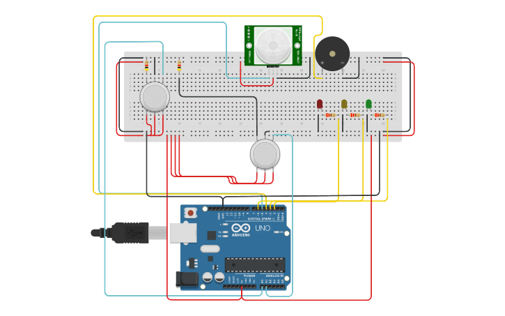

# 🏠 Sistema de Segurança Residencial de Baixo Custo

Projeto desenvolvido com Arduino e simulado no **Tinkercad**, com o objetivo de criar um sistema de segurança residencial de baixo custo capaz de monitorar diferentes condições do ambiente.

O sistema utiliza sensores de **fumaça, gás e movimento**, acionando LEDs e um buzzer de acordo com as situações detectadas.

## 📌 Sobre o projeto

O projeto foi desenvolvido para aplicar conceitos de programação em Arduino e integração entre software e componentes eletrônicos.

O sistema realiza continuamente a leitura de três sensores:

- Sensor de fumaça;
- Sensor de gás;
- Sensor de presença/movimento.

Cada sensor possui uma função específica responsável por realizar sua leitura e controlar os componentes de sinalização correspondentes.

## ⚙️ Funcionamento

O Arduino realiza continuamente a leitura dos sensores.

### Sensor de fumaça

O sensor de fumaça utiliza uma entrada analógica para realizar a leitura do ambiente.

Quando o valor obtido ultrapassa o limite definido no programa, o sistema considera que há fumaça detectada e aciona o LED correspondente.

### Sensor de gás

O sensor de gás também utiliza uma entrada analógica.

Quando o valor lido ultrapassa o limite estabelecido no programa, o LED correspondente é acionado e a informação é exibida no Monitor Serial.

### Sensor de presença

O sensor PIR realiza uma leitura digital para identificar movimento.

Quando um movimento é detectado:

- O buzzer é acionado;
- O LED correspondente é aceso;
- Uma mensagem de alerta é enviada ao Monitor Serial.

Quando não há movimento, o buzzer e o LED são desligados.

## 🔄 Fluxo do sistema

O funcionamento principal pode ser representado da seguinte forma:

**Leitura do sensor de fumaça → Leitura do sensor de gás → Leitura do sensor de presença → Repetição do ciclo**

Cada leitura possui uma função própria:

- `sensorFum()` — leitura do sensor de fumaça;
- `sensorGas()` — leitura do sensor de gás;
- `sensorPir()` — leitura do sensor de presença.

## 💡 Componentes utilizados

- Arduino;
- Sensor de fumaça;
- Sensor de gás;
- Sensor PIR de movimento;
- 3 LEDs;
- Buzzer;
- Componentes auxiliares utilizados na montagem do circuito.

## 📊 Monitoramento

Além dos indicadores físicos simulados no circuito, o sistema utiliza a comunicação serial para apresentar informações sobre as leituras.

O Monitor Serial pode informar, por exemplo:

- Valor obtido pelo sensor de fumaça;
- Valor obtido pelo sensor de gás;
- Detecção ou ausência de movimento.

A comunicação serial é configurada com velocidade de **9600 baud**.

## 🧠 Conceitos praticados

- Programação de microcontroladores;
- Arduino;
- Leitura de sensores analógicos;
- Leitura de sensores digitais;
- Estruturas condicionais;
- Criação e utilização de funções;
- Controle de LEDs;
- Acionamento de buzzer;
- Comunicação serial;
- Automação e sistemas embarcados;
- Simulação de circuitos eletrônicos.

## 🖥️ Simulação

O projeto foi desenvolvido e testado utilizando o **Tinkercad**, permitindo simular o circuito e observar o comportamento dos sensores e dos componentes de saída.

### 🔗 Projeto no Tinkercad

[**Acessar a simulação do projeto**](https://www.tinkercad.com/things/erH1cEDsHv6-projeto-de-sistema-de-seguranca-residencial-)

## 🎓 Objetivo acadêmico

O objetivo do projeto foi desenvolver um sistema de segurança residencial de baixo custo, aplicando conhecimentos de programação e sistemas embarcados para integrar sensores e dispositivos de alerta.

O projeto também teve como objetivo praticar a criação de funções específicas para a leitura dos sensores e o controle dos componentes conectados ao Arduino.

## 👤 Autor

**Gabriel Sena**

Estudante de Engenharia da Computação, com interesse em desenvolvimento de software, tecnologia e sistemas embarcados.
